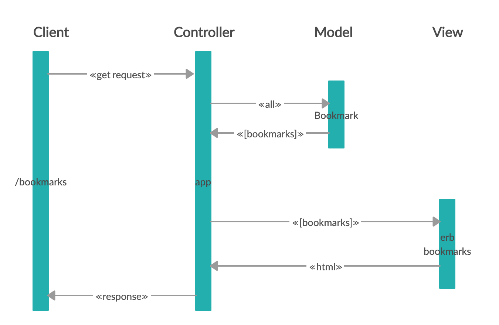

# Bookmark manager project
Makers Week 4 afternoon challenge.

**Tech used**:


## Project requirements
* Show a list of bookmarks
* Add new bookmarks
* Delete bookmarks
* Update bookmarks
* Comment on bookmarks
* Tag bookmarks into categories
* Filter bookmarks by tag
* Users are restricted to manage only their own bookmarks

### User stories

```
As a time-pressed user
So that I may view my favourite websites quickly
I would like to see a list of my bookmarks

As a time-pressed user
So that I can save a website
I would like to add the site's address and title to bookmark manager

As a user
So that I may save bookmark data for later retrieval
I would like to add a new bookmark to bookmark manager

As a user
So I can remove my bookmark from Bookmark Manager
I want to delete a bookmark

As a user
So I can change a bookmark in Bookmark Manager
I want to update a bookmark

As a user
So that the bookmarks I save are useful
I only want to save valid URLs

As a user
So that I can leave describe my bookmarks
I want to be able to add comments to my bookmark

As a user
So that I can categorize my bookmarks
I want to add a Tag to a Bookmark

As a user
So that I can find relevant bookmarks
I want to filter Bookmarks by a Tag

As a user
So that I can have a personalised bookmark list
I want to sign up with my email address

```
## Domain Model


| Component   | Responsibility                                | Refactor                                |
|------------ |---------------------------------------------  |---------------------------------------- |
| Model       | Encapsulate logic with relevant data          | Encapsulate bookmark data in a class    |
| View        | Display the result to a user                  | Show the bookmark data in a list        |
| Controller  | Get data from the model and put in the view   | Render bookmark data into to the view   |


## Installation instructions
**Setting up the databases**
Connect to `psql` and create the `bookmark_manager` and `bookmark_manager_test` databases:
```
CREATE DATABASE bookmark_manager;
CREATE DATABASE bookmark_manager_test;
```
To set up the appropriate tables, connect to each database in `psql` 
``` 
\c bookmark_manager;
\c bookmark_manager_test;
```
 Run the SQL scripts in the `db/migrations` folder in the given order.

**Installing the program**
1. Requires Ruby. Instructions to install are [here](https://www.ruby-lang.org/en/documentation/installation/).
2. Fork this repo, and clone to your local machine
3. Run the command `gem install bundle`
4. When the installation completes, run `bundle` 
5. Navigate to the root folder and input 
```rackup```
This will show you the port that you should use in your browser (in this case it is `port=9292`).
6. Input the following into your browser:
```http://localhost:9292/```

### Possible improvements
* When inputting a url that doesn't include http or https, the program should automatically add this to the url. The flash warning should only appear if the program receives an error response from the server.
* Styled warning box.